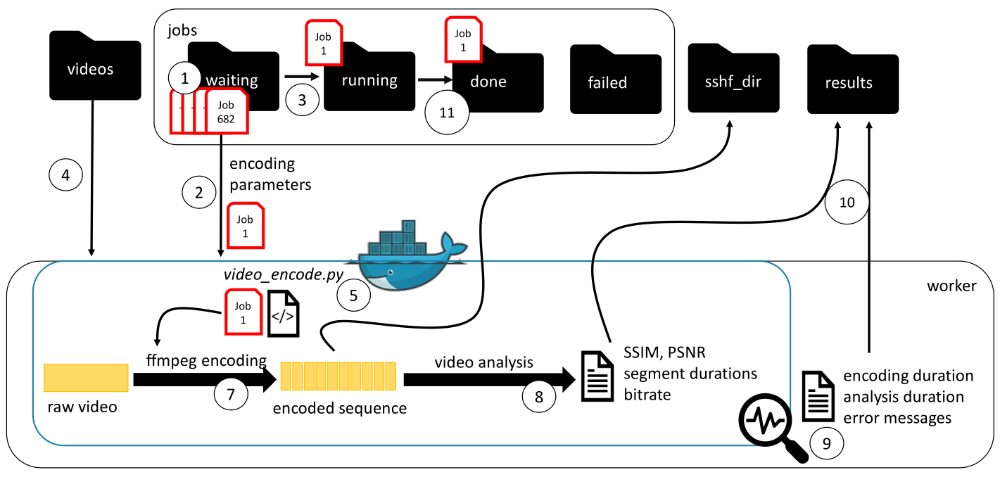

# Docker Video Encoding
Framework used in the ACM MMSys'20 paper "Comparing fixed and variable segment durations for adaptive video streaming: a holistic analysis". [Available here](https://dl.acm.org/doi/abs/10.1145/3339825.3391858)

Docker container for DASH video encoding using FFMPEG.
The following parameters can be specified:

* **video:** input video
* **reference_video:** reference video for quality calculation
* **crf:** target output quality
* **min_length:** minimum duration of a segment in seconds (relevant in case of variable segment duration encoding)
* **max_length:** maximum duration of a segment in seconds (relevant in case of variable segment duration encoding)
* **target_seg_length:** fix duration in seconds of all video segments (in case of variable set target_seg_length=0.0)
* **encoder:** encoder. supported: x264. planned to be supported: x265, vp9
* **timestamps:** I-frame positions from reference encoding
* **cst_bitrate:** target bitrate for constant bitrate encoding (cbr)

If the source video shall be splitted into segments of fixed duration, set maxdur=mindur=target_seg_length=[fix duration]; If the source video shall be splitted into segments of variable duration, please set target_seg_length=0.0. You can find example job files under `samples/jobs/00_waiting/`.

## Requirements

- Docker
- Python

## QUICKSTART (MMSYS)

Additional Requirements:

  * Linux OS
  * wget
  * screen

Steps 2, 3 and 4 are optional and can be skipped, if only example files should be used.

  1. Run `init_mmsys.sh`
  2. Create Job Files as described [here](https://github.com/fg-inet/video-scripts).
  3. Copy them into `jobs/00_waiting/`.
  4. Copy the source videos into `videos/`.
  5. Run `run_workers_mmsys.sh`.
  6. Video statistics file are located at `results/` and encoded videos at `sshfs_dir/`.

## Explanation

Different examples:

* *bigbuckbunny480p24x30s_var_vbr_job001.txt*: Variable Length VBR encoding
* *bigbuckbunny480p24x30s_var_cbr_job002.txt*: Variable Length CBR encoding
* *bigbuckbunny480p24x30s_fix_vbr_job003.txt*: Fixed Length VBR encoding
* *bigbuckbunny480p24x30s_fix_cbr_job004.txt*: Fixed Length CBR encoding

### Variable Length VBR encoding
template-file: [bigbuckbunny480p24x30s_var_vbr_job001.txt](samples/jobs/00_waiting/bigbuckbunny480p24x30s_var_vbr_job001.txt)

    ffmpeg -i /videos/bigbuckbunny480p24x30s.y4m -nostats -map 0:0 -threads 1 -vcodec libx264 -crf 16 -x264-params keyint=0:min-keyint=96:scenecut=-1 -force_key_frames 0.0,1.0,2.0 -use_timeline 1 -use_template 1 -hls_playlist 1 -seg_duration 0  -use_timeline 1 -f dash /tmpdir/crf_16.mpd

### Variable Length CBR encoding
template-file: [bigbuckbunny480p24x30s_var_cbr_job002.txt](samples/jobs/00_waiting/bigbuckbunny480p24x30s_var_cbr_job002.txt)

    ffmpeg -i /videos/bigbuckbunny480p24x30s.y4m -nostats -map 0:0 -threads 1 -vcodec libx264 -crf 16 -x264-params keyint=0:min-keyint=96:scenecut=-1 -force_key_frames 123456 -use_timeline 1 -use_template 1 -hls_playlist 1 -seg_duration 0  -use_timeline 1 -f dash /tmpdir/crf_16.mpd

### Fixed Length VBR encoding
template-file: [bigbuckbunny480p24x30s_fix_cbr_job004.txt](samples/jobs/00_waiting/bigbuckbunny480p24x30s_fix_vbr_job003.txt)

    ffmpeg -i /videos/bigbuckbunny480p24x30s.y4m -nostats -threads 1 -map 0:0 -vcodec libx264 -x264-params keyint=96:min-keyint=96 -use_timeline 0 -use_template 0 -hls_playlist 1 -seg_duration 4.0 -force_key_frames 'expr:gte(t,n_forced*4.0)' -crf 16  /tmpdir/crf_16.mpd

### Fixed Length CBR encoding
template-file: [bigbuckbunny480p24x30s_fix_vbr_job003.txt](samples/jobs/00_waiting/bigbuckbunny480p24x30s_fix_vbr_job003.txt)

First Pass:

    ffmpeg -i /videos/bigbuckbunny480p24x30s.y4m -nostats -threads 1 -map 0:0 -vcodec libx264 -x264-params keyint=96:min-keyint=96 -use_timeline 0 -use_template 0 -hls_playlist 1 -seg_duration 4.0 -force_key_frames 'expr:gte(t,n_forced*4.0)' -pass 1 -b:v 123456.0 -f null -

Second Pass:

    ffmpeg -i /videos/bigbuckbunny480p24x30s.y4m -nostats -threads 1 -map 0:0 -vcodec libx264 -x264-params keyint=96:min-keyint=96 -use_timeline 0 -use_template 0 -hls_playlist 1 -seg_duration 4.0 -force_key_frames 'expr:gte(t,n_forced*4.0)' -pass 2 -b:v 123456.0 -f dash /tmpdir/crf_16.mpd

